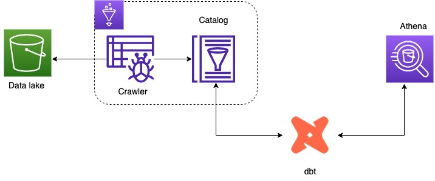
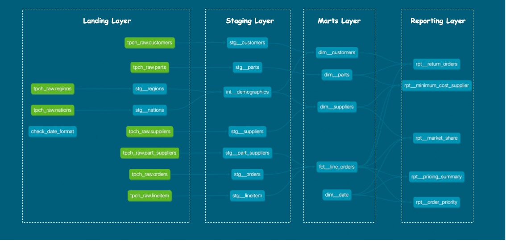

## Transformation pipeline with dbt
This example demonstrates how you can build a downstream data pipeline using dbt on Amazon Athena. Outputs of this pipeline are created as views and tables in the glue catalog.

## Prerequisites
- AWS CLI
- Install dbt athena adapter
    `pip install dbt-athena-community`

### Connecting to Amazon Athena
```
tpch:
  target: dev
  outputs:
    dev:
      type: athena
      s3_staging_dir: [S3 URI with prefix]
      region_name: [AWS REGION]
      schema: [Schema name]
      database: [database name]
      aws_profile_name: [your AWS Profile]
```

### Instructions
* Download the data from <a href = "https://docs.cambridgesemantics.com/anzograph/v2.2/userdoc/ghib.htm#load-ghib"> here </a> and upload to your S3 bucket. 

* Each table should be saved under their prefix. For instance, to save your customer table data it should be under `s3://your_bucket/customers/data.csv`. 

* Once uploaded, create a glue crawler and run it. This should crawl all the folders and create tables in the glue catalog. The database name for this project is `tpch_raw`

* Now from your root directory, install all dbt dependencies `dbt deps`

* Finally, `dbt run --project-dir . --profiles-dir .` 

This should create a new schema in your glue catalog based on the schema name you provided in your dbt profile.

#### Original Database Schema


#### Architecture



#### Data Lineage


